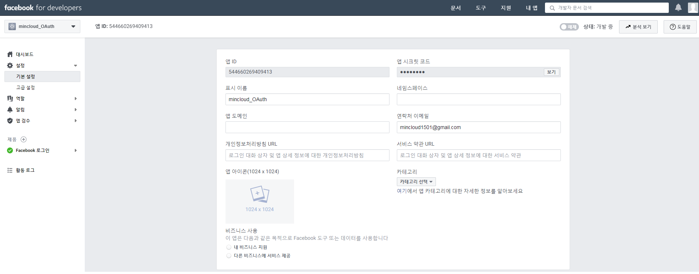
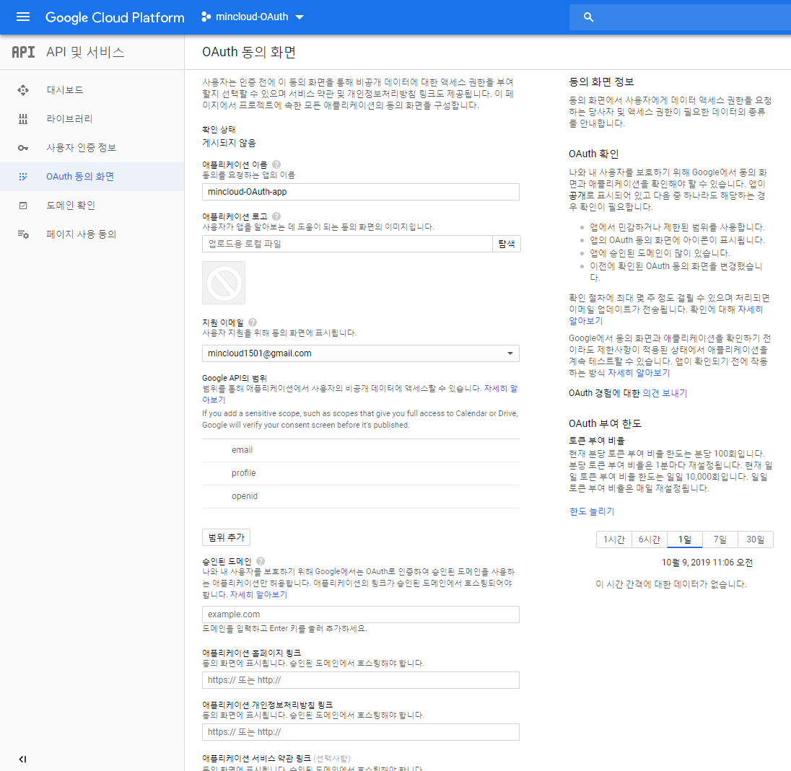

# OAuth2 Project
[](https://oauth.net/2/)&nbsp;
[](https://developers.facebook.com/docs/facebook-login/manually-build-a-login-flow)&nbsp;
[](https://developers.facebook.com/docs/facebook-login/web)&nbsp;
[](https://developers.google.com/identity/sign-in/web/reference)&nbsp;
&nbsp;

OAuth2 는 OAuth 프로토콜의 버전 2

## OAuth 1.0의 특징
- API 인증 시, 3rd application에게 사용자의 password을 노출하지 않고 인증
- 인증(Authentication)과 API 권한(Authorization) 부여를 동시에 가능
- 3-legged OAuth : user / consumer / service provider

## OAuth 2.0의 개선사항
- OAuth 2.0은 1.0과 호환되지 않음
- 모바일에서의 사용성 문제나 서명과 같은 개발이 복잡하고 기능과 규모의 확장성 등을 지원하기 위해 만들어진 표준
- 표준이 매우 크고 복잡해서 이름도 `OAuth 인증 프레임워크(OAuth 2.0 Authorization Framework)` (http://tools.ietf.org/wg/oauth/)
- OAuth 1.0에서는 HTTPS가 필수이나, Signature 없이 생성/호출 가능하고 URL 인코딩이 필요 없음

## OAuth 2.0의 4 Roles
`√ Resource Owner`

- 보호 자원에 대한 액세스 권한을 부여 할 수 있는 Entity (`사용자`)

`√ Authorization Server`

- Resource 소유자를 인증(Authentication)하고 권한을 얻은 후(Authorization) Client에게 Access Token을 부여 (`인증서버 [API 서버와 같을 수도 있음`])

`√ Resource Server`

- Resource에 대한 access를 허용하거나 최소한 고려하기 위해 Access Token이 필요한 구성 요소 (`REST API 서버`)

`√ Client`

- 권한 서버에서 Access Token을 얻을 수 있는 Entity (`3rd Party application [Service]`)

## Token 방식
`√ Access Token`

- 타사 응용 프로그램에서 사용자 데이터에 액세스 할 수 있기 때문에 가장 중요
- 클라이언트에서 매개 변수 또는 요청의 헤더로 리소스 서버에 전송
- 권한 서버에 의해 정의되고 수명이 제한

`√ Refresh Token`

- Access Token과 함께 발급되지만 클라이언트에서 리소스 서버로 각 요청에 전송되지 않음
- Access Token이 만료되었을 때 갱신하기 위해 권한 부여 서버로 전송

## 승인 방식
`√ Authorization Code Grant Type` : 권한 부여 코드 승인 타입

- 클라이언트가 다른 사용자 대신 특정 리소스에 접근을 요청할 때 사용
- 리스소 접근을 위한 사용자 명과 비밀번호, 권한 서버에 요청해서 받은 권한 코드를 함께 활용하여 리소스에 대한 엑세스 토큰을 받는 방식

`√ Implicit Grant Type` : 암시적 승인

- 권한 부여 코드 승인 타입과 다르게 권한 코드 교환 단계 없이 엑세스 토큰을 즉시 반환받아 이를 인증에 이용하는 방식

`√ Resource Owner Password Credentials Grant Type` : 리소스 소유자 암호 자격 증명 타입

- 클라이언트가 암호를 사용하여 엑세스 토큰에 대한 사용자의 자격 증명을 교환하는 방식

`√ Client Credentials Grant Type` : 클라이언트 자격 증명 타입

- 클라이언트가 컨텍스트 외부에서 액세스 토큰을 얻어 특정 리소스에 접근을 요청할 때 사용하는 방식

---
## Prerequisites for running
- visual studio code : https://code.visualstudio.com/
- nodejs : https://nodejs.org/en/
- local-web-server : https://www.npmjs.com/package/local-web-server
- facebook.com 회원 가입
- google.com 회원 가입

[Facebook appId 발급]


[Google client-id 발급]


[facebook-sdk.html]
```js
<script>
...
    window.fbAsyncInit = function () {
        FB.init({
            appId: 'xxxxxxxxxxxxxxx', # 여기에 Facebook에서 생성한 appId 입력
            autoLogAppEvents: true,
            xfbml: true,
            version: 'v3.1'
        });

        console.log('Init');
        refreshAuthStatus();

    };
...
</script>
```

[google-sdk.html]
```js
<script>
    function init() {
        console.log('init');    
        gapi.load('auth2', function () {
            console.log('auth2');
            var gauth = gapi.auth2.init({
                client_id: 'xxxxxxxxxxxxxxxxxxxx.apps.googleusercontent.com' # 여기에 Google에서 생성한 client-id 입력
            });
            gauth.then(function () {
                console.log('auth init success');
                refreshAuthStatus();
            }, function () {
        onsole.log('auth fail');
            })
        });
    }
</script>
```

---
## Run
- Visual Studio Code 실행하여 Web Server Lunch

```
Microsoft Windows [Version 6.1.7601]
Copyright (c) 2009 Microsoft Corporation. All rights reserved.

C:\OAuth2>ws
Listening on http://127.0.0.1:8000
```

- http://localhost:8000/facebook-sdk.html 
- http://localhost:8000/google-sdk.html 

---
## To DO
- mini Resource Server 구축
- Zuul과 연동